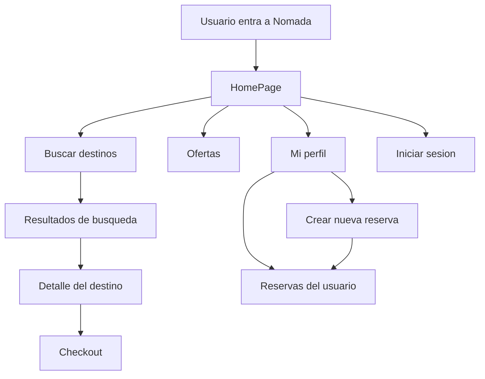
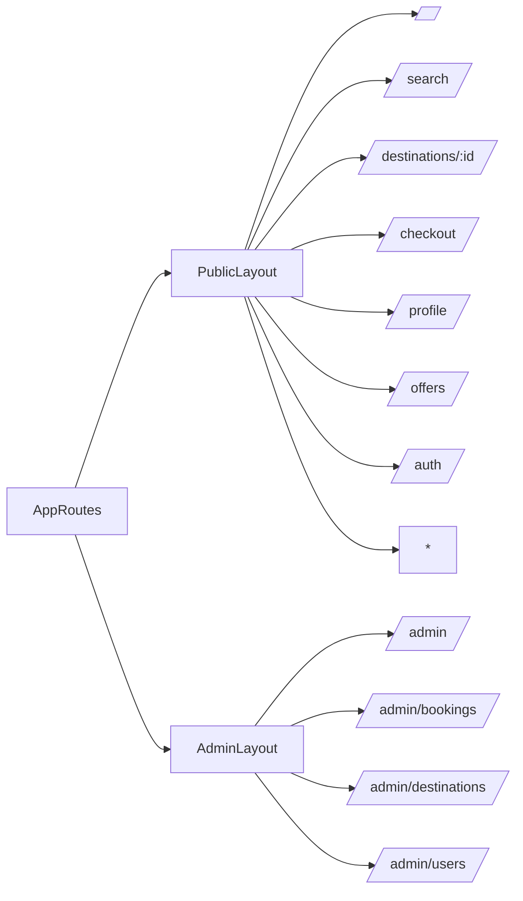
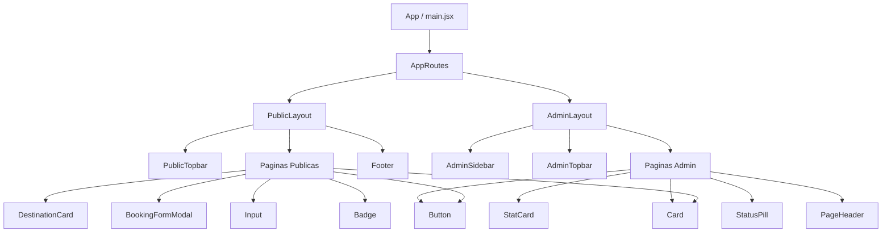

# Nomada - Frontend Travel Agency

Aplicacion frontend para una agencia de viajes. El proyecto permite explorar destinos, consultar ofertas, simular un proceso de reserva, ver el perfil del usuario y acceder a una zona de administracion con reservas, destinos y usuarios.

El objetivo principal es mostrar una experiencia completa de una agencia de viajes usando React, rutas separadas para cliente y administrador, componentes reutilizables y una interfaz visual construida con Tailwind CSS.

## Tecnologias Usadas

- React 19
- Vite 8
- React Router DOM
- Tailwind CSS
- Lucide React para iconos
- ESLint

## Como Ejecutar el Proyecto

Instalar dependencias:

```bash
npm install
```

Iniciar entorno de desarrollo:

```bash
npm run dev
```

Generar build de produccion:

```bash
npm run build
```

Previsualizar el build:

```bash
npm run preview
```

## Estructura del Proyecto

```text
src/
  components/
    common/        Componentes reutilizables del dominio de viajes
    layout/        Layouts, barras de navegacion, sidebar y logo
    ui/            Componentes base de interfaz
  constants/       Rutas, navegacion y datos mock
  pages/           Paginas principales de la aplicacion
  routes/          Configuracion de rutas
  utils/           Funciones auxiliares
```

## Componentes Principales

### Layout

- `PublicLayout`: estructura general de la parte publica. Incluye `PublicTopbar`, contenido principal y `Footer`.
- `AdminLayout`: estructura del panel de administracion. Incluye `AdminSidebar`, `AdminTopbar` y un overlay responsive para el menu movil.
- `PublicTopbar`: navegacion publica con enlaces a Inicio, Buscar, Ofertas, Mi perfil e Iniciar sesion.
- `AdminSidebar`: menu lateral del area admin con accesos a Panel, Reservas, Destinos y Usuarios.
- `AdminTopbar`: barra superior del panel admin con buscador y usuario.
- `BrandMark`: logo de la aplicacion usando el asset `public/nomada-logo-symbol.png`.
- `Footer`: pie de pagina de la parte publica.

### UI Base

- `Button`: boton reutilizable con variantes `primary`, `secondary`, `ghost` y `danger`.
- `Card`: contenedor reutilizable para tarjetas.
- `Input`: campo de formulario reutilizable con label, hint y estilos de foco.
- `Badge`: etiqueta visual para destacar estados o categorias.
- `PageHeader`: encabezado reutilizable para paginas con titulo, descripcion y acciones.

### Componentes del Dominio

- `DestinationCard`: tarjeta de destino con imagen, pais, precio, rating y enlace al detalle.
- `BookingFormModal`: modal para crear una nueva reserva desde el perfil.
- `StatCard`: tarjeta de estadistica para el dashboard admin.
- `StatusPill`: indicador visual para estados de reservas.

## Paginas

### Parte Publica

- `HomePage`: pagina inicial con hero, buscador rapido y destinos destacados.
- `SearchResultsPage`: listado de resultados con filtros de tipo de viaje, bus y precio.
- `DestinationDetailPage`: detalle de un destino con imagen, precio, highlights e itinerario.
- `CheckoutPage`: flujo de reserva por pasos.
- `ProfilePage`: perfil del usuario, reservas y creacion de nueva reserva mediante modal.
- `OffersPage`: destinos con descuento.
- `AuthPage`: pantalla de inicio de sesion y registro.
- `NotFoundPage`: pagina para rutas no encontradas.

### Panel Admin

- `DashboardPage`: resumen con metricas, reservas recientes y acciones rapidas.
- `BookingsPage`: tabla de reservas con buscador y estados.
- `DestinationsPage`: gestion visual de destinos disponibles.
- `UsersPage`: listado de usuarios.

## Como Funciona

La aplicacion se divide en dos areas principales:

- Area publica: enfocada en el usuario final que busca destinos, revisa ofertas, consulta detalles y simula reservas.
- Area admin: enfocada en la gestion interna de reservas, destinos y usuarios.

React Router define dos layouts distintos. Las rutas publicas usan `PublicLayout`; las rutas que comienzan por `/admin` usan `AdminLayout`.

Los datos se cargan desde `src/constants/mockData.js`. Esto permite presentar la aplicacion sin depender de un backend real. Los destinos, reservas, usuarios, buses, conductores y pasos del checkout estan centralizados en ese archivo.

El sistema visual se controla principalmente desde `tailwind.config.js`, donde se definen los colores `brand`, `surface`, `ink`, estados, sombras y radios. Los componentes usan clases Tailwind basadas en esos tokens para mantener una identidad visual consistente.

## Flujo de Navegacion



## Diagrama de Rutas



## Diagrama de Componentes



## Datos Mock

El archivo `src/constants/mockData.js` contiene:

- `FEATURED_DESTINATIONS`: destinos destacados con precio, imagen, rating y etiqueta.
- `BOOKINGS`: reservas de ejemplo.
- `USERS`: usuarios de ejemplo.
- `CHECKOUT_STEPS`: pasos del proceso de reserva.
- `BUSES`: buses disponibles para filtros.
- `DRIVERS`: conductores de ejemplo.

Estos datos permiten simular una experiencia real sin configurar una API externa.

## Personalizacion Visual

La identidad visual se configura desde `tailwind.config.js`:

- `brand`: colores principales para botones, enlaces activos, iconos y elementos destacados.
- `surface`: fondos, paneles, inputs y bordes.
- `ink`: colores de texto.
- `status`: colores para estados como confirmado, pendiente, aviso e informacion.
- `boxShadow`: sombras reutilizables para tarjetas y foco.

El logo principal esta en:

```text
public/nomada-logo-symbol.png
```

## Puntos Para la Presentacion

- El proyecto esta separado entre experiencia publica y panel de administracion.
- Los layouts evitan repetir estructura en cada pagina.
- Los componentes UI (`Button`, `Card`, `Input`, `Badge`) ayudan a mantener consistencia.
- Los datos mock permiten presentar el flujo completo sin backend.
- Tailwind centraliza la identidad visual mediante tokens de color.
- React Router organiza la navegacion y permite rutas anidadas.
- El perfil incluye una interaccion real con estado local: crear una reserva desde un modal.

## Scripts Disponibles

```bash
npm run dev      # Ejecuta el servidor de desarrollo
npm run build    # Crea el build de produccion
npm run preview  # Previsualiza el build
npm run lint     # Ejecuta ESLint
```

