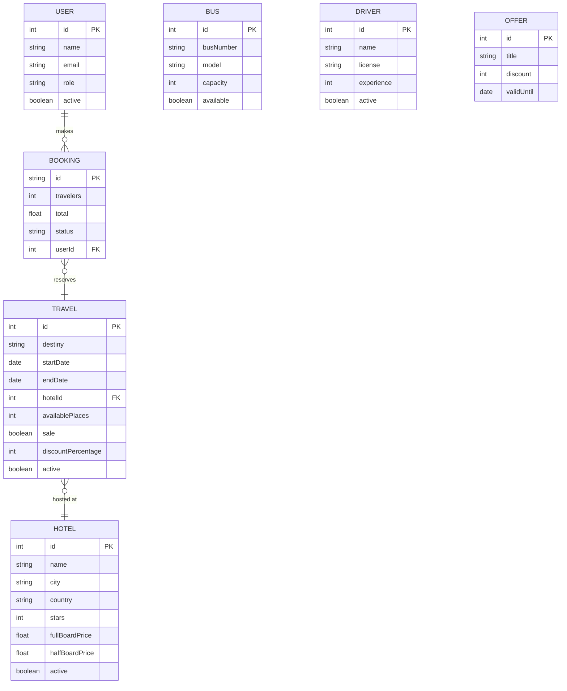

qui<div align="center">

# ✈️ NOMADA — Travel Agency

**Full-stack web application for travel package booking and agency management**

[](https://react.dev/)
[](https://vitejs.dev/)
[](https://tailwindcss.com/)
[](https://expressjs.com/)
[](LICENSE)

</div>

---

## Table of Contents

- [About the Project](#about-the-project)
- [Screenshots](#screenshots)
- [Flow Diagram](#flow-diagram)
- [Tech Stack](#tech-stack)
- [Architecture](#architecture)
- [Data Model & Entity Relationships](#data-model--entity-relationships)
- [Getting Started](#getting-started)
- [Environment Variables](#environment-variables)
- [API Reference](#api-reference)
- [Available Scripts](#available-scripts)
- [Project Structure](#project-structure)
- [Testing](#testing)
- [Deployment](#deployment)
- [Roadmap](#roadmap)
- [Contributing](#contributing)
- [Developers](#developers)

---

## About the Project

**NOMADA** is a travel agency web platform built as a real-world project for **Factoría F5**. It allows customers to browse, search, and book travel packages, while providing agency staff with a full admin dashboard to manage destinations, hotels, buses, drivers, bookings, and users.

**Key features:**
- Public storefront: browse destinations, view offers, search for packages
- Booking flow: select travel, choose hotel, and confirm reservation
- Role-based access control: `admin` and `user` roles with protected routes
- Admin dashboard: full CRUD for travels, hotels, buses, drivers, bookings, and users
- JWT authentication with persistent session via `localStorage`

---

## Screenshots

> _Add screenshots here — replace each placeholder with the actual image path_

| Home Page | Destinations |
|:---------:|:------------:|
|  |  |

| Booking Flow | Admin Dashboard |
|:------------:|:---------------:|
|  |  |

---

## Flow Diagram

> _Insert the application flow diagram below_


---

## Tech Stack

### Frontend
| Technology | Version | Purpose |
|---|---|---|
| [React](https://react.dev/) | 19.2.5 | UI framework |
| [Vite](https://vitejs.dev/) | 8.0 | Build tool & dev server |
| [React Router DOM](https://reactrouter.com/) | 6.30 | Client-side routing |
| [Tailwind CSS](https://tailwindcss.com/) | 3.4 | Utility-first styling |
| [Axios](https://axios-http.com/) | 1.16 | HTTP client |
| [Lucide React](https://lucide.dev/) | latest | Icon library |

### Backend
| Technology | Version | Purpose |
|---|---|---|
| [Express](https://expressjs.com/) | 4.22 | REST API server |
| [JSON Web Token](https://jwt.io/) | 9.0 | Authentication |
| [CORS](https://www.npmjs.com/package/cors) | 2.8 | Cross-origin requests |

### Testing & Tooling
| Technology | Purpose |
|---|---|
| [Playwright](https://playwright.dev/) | End-to-end testing |
| [ESLint](https://eslint.org/) | Code linting |
| [Concurrently](https://www.npmjs.com/package/concurrently) | Run frontend + backend together |

---

## Architecture

The project follows **Atomic Design** for the component layer:

```
Atoms → Molecules → Organisms → Pages
```

- **Atoms** — base UI elements: `Button`, `Input`, `Card`, `Badge`
- **Molecules** — composed elements: `FormField`, `Alert`, `SearchBar`
- **Organisms** — feature blocks: CRUD tables, booking forms, destination cards
- **Pages** — full views assembled from organisms

State is managed locally with React hooks (`useState`, `useEffect`). The backend is an Express server with an in-memory data store, serving a REST API on port `8080`.

---

## Data Model & Entity Relationships

### Entities

#### User
| Field | Type | Description |
|-------|------|-------------|
| `id` | number | Primary key |
| `name` | string | Full name |
| `email` | string | Unique email (login) |
| `password` | string | Plain text (dev only) |
| `role` | `ADMIN` \| `USER` | Access level |
| `dni` | string | National ID (users only) |
| `phone` | string | Contact phone |
| `active` | boolean | Account status |

#### Travel
| Field | Type | Description |
|-------|------|-------------|
| `id` | number | Primary key |
| `destiny` | string | Destination name |
| `startDate` | date | Departure date |
| `endDate` | date | Return date |
| `hotelId` | number | **FK → Hotel** |
| `availablePlaces` | number | Seats remaining |
| `sale` | boolean | On sale flag |
| `discountPercentage` | number | Discount % if on sale |
| `active` | boolean | Listing status |

#### Hotel
| Field | Type | Description |
|-------|------|-------------|
| `id` | number | Primary key |
| `name` | string | Hotel name |
| `city` | string | City |
| `country` | string | Country |
| `stars` | number | Star rating (1–5) |
| `capacity` | number | Total rooms |
| `availablePlaces` | number | Available rooms |
| `fullBoardPrice` | number | Price per night (full board) |
| `halfBoardPrice` | number | Price per night (half board) |
| `active` | boolean | Active status |

#### Booking
| Field | Type | Description |
|-------|------|-------------|
| `id` | string | Primary key (`TR-XXXX`) |
| `destination` | string | Destination label |
| `dates` | string | Date range |
| `travelers` | number | Number of travelers |
| `total` | number | Total price (€) |
| `status` | `confirmed` \| `pending` | Booking state |
| `userId` | number | **FK → User** |

#### Bus
| Field | Type | Description |
|-------|------|-------------|
| `id` | number | Primary key |
| `busNumber` | string | Fleet identifier |
| `model` | string | Manufacturer model |
| `capacity` | number | Passenger capacity |
| `available` | boolean | Availability |

#### Driver
| Field | Type | Description |
|-------|------|-------------|
| `id` | number | Primary key |
| `name` | string | Full name |
| `license` | string | Driver license number |
| `experience` | number | Years of experience |
| `active` | boolean | Active status |

#### Offer
| Field | Type | Description |
|-------|------|-------------|
| `id` | number | Primary key |
| `title` | string | Offer title |
| `description` | string | Short description |
| `discount` | number | Discount percentage |
| `validUntil` | date | Expiry date |

---

### Entity Relationship Diagram



**Key relationships:**
- `Travel` belongs to one `Hotel` (N:1 via `hotelId`)
- `Booking` belongs to one `User` (N:1 via `userId`)
- One `User` can have many `Bookings` (1:N)
- One `Hotel` can be linked to many `Travels` (1:N)
- `Bus` and `Driver` are managed independently (assigned to travels at the operational level)
- `Offer` is standalone — applies promotional discounts displayed on the storefront

---

### Roles & Permissions

| Action | `USER` | `ADMIN` |
|--------|:------:|:-------:|
| Browse travels & hotels | ✅ | ✅ |
| View offers | ✅ | ✅ |
| Register / Login | ✅ | ✅ |
| Create a booking | ✅ | ✅ |
| View own bookings | ✅ | ✅ |
| View all bookings | ❌ | ✅ |
| View all users | ❌ | ✅ |
| Create / edit / delete Travel | ❌ | ✅ |
| Create / edit / delete Hotel | ❌ | ✅ |
| Create / edit / delete Bus | ❌ | ✅ |
| Create / edit / delete Driver | ❌ | ✅ |
| Create / edit / delete Offer | ❌ | ✅ |
| Manage users | ❌ | ✅ |
| Access admin dashboard | ❌ | ✅ |

> Protected routes on both frontend (React Router guards) and backend (JWT middleware `verifyToken`) enforce these permissions.

---

## Getting Started

### Prerequisites

- [Node.js](https://nodejs.org/) v18 or higher
- npm v9 or higher

### Installation

```bash
# 1. Clone the repository
git clone https://github.com/Agencia-de-viajes-Factoria-F5-Nomada/Frontend-Travel-Agency.git
cd Frontend-Travel-Agency

# 2. Install dependencies
npm install

# 3. Configure environment variables
cp .env.example .env
# Edit .env if your backend runs on a different port
```

### Running the App

**Option A — single command (recommended):**
```bash
npm run dev:full
```

**Option B — two terminals:**
```bash
# Terminal 1 — backend API
npm run server

# Terminal 2 — frontend
npm run dev
```

| Service | URL |
|---------|-----|
| Frontend | http://localhost:5173 |
| Backend API | http://localhost:8080/api |
| Health check | http://localhost:8080/api/health |

### Test Credentials

| Role | Email | Password |
|------|-------|----------|
| Admin | `admin@travel.io` | `admin123` |
| User | `marta@travel.io` | `user123` |

---

## Environment Variables

Create a `.env` file in the project root:

```env
VITE_API_URL=http://localhost:8080
```

| Variable | Default | Description |
|---|---|---|
| `VITE_API_URL` | `http://localhost:8080` | Base URL of the backend API |

---

## API Reference

All endpoints are prefixed with `/api`.

| Resource | Endpoint | Methods |
|---|---|---|
| Auth | `/api/auth/login` | `POST` |
| Travels | `/api/travels` | `GET POST PUT DELETE` |
| Hotels | `/api/hotels` | `GET POST PUT DELETE` |
| Buses | `/api/buses` | `GET POST PUT DELETE` |
| Drivers | `/api/drivers` | `GET POST PUT DELETE` |
| Bookings | `/api/bookings` | `GET POST PUT DELETE` |
| Users | `/api/users` | `GET POST PUT DELETE` |
| Offers | `/api/offers` | `GET POST PUT DELETE` |
| Health | `/api/health` | `GET` |

Authentication is required for protected endpoints — include the JWT token as a Bearer token in the `Authorization` header:

```
Authorization: Bearer <token>
```

---

## Available Scripts

```bash
npm run dev          # Start frontend dev server (port 5173)
npm run server       # Start backend API server (port 8080)
npm run dev:full     # Start both concurrently
npm run build        # Production build
npm run preview      # Preview production build
npm run lint         # Run ESLint
npm run e2e:install  # Install Playwright browsers
npm run e2e:test     # Run end-to-end tests
npm run kill:port    # Kill process on port 8080 (Windows)
```

---

## Project Structure

```
├── public/                  # Static assets
├── src/
│   ├── assets/              # Images and media
│   ├── components/
│   │   ├── atoms/           # Base UI components
│   │   ├── molecules/       # Composite components
│   │   ├── organisms/       # Feature-level components
│   │   └── layout/          # Layout wrappers
│   ├── constants/           # Routes, API paths, navigation
│   ├── hooks/               # Custom React hooks
│   ├── pages/               # Full page views
│   ├── routes/              # Route configuration
│   ├── services/            # API service layer (Axios)
│   ├── utils/               # Helpers and formatters
│   ├── index.css            # Global styles
│   └── main.jsx             # App entry point
├── server.js                # Express backend server
├── vite.config.js           # Vite configuration
├── tailwind.config.js       # Tailwind configuration
└── .env                     # Environment variables
```

---

## Developers

Built with dedication by:

| | Name | GitHub |
|---|---|---|
| 👨‍💻 | **Facundo** | [@facundo](https://github.com/facundo) |
| 👩‍💻 | **Maria** | [@Maria19761976](https://github.com/Maria19761976) |

Project developed as part of the **Factoría F5** bootcamp program.

---

<div align="center">

Made with ❤️ by **NOMADA Team** · Factoría F5 · 2026que mas 


</div>